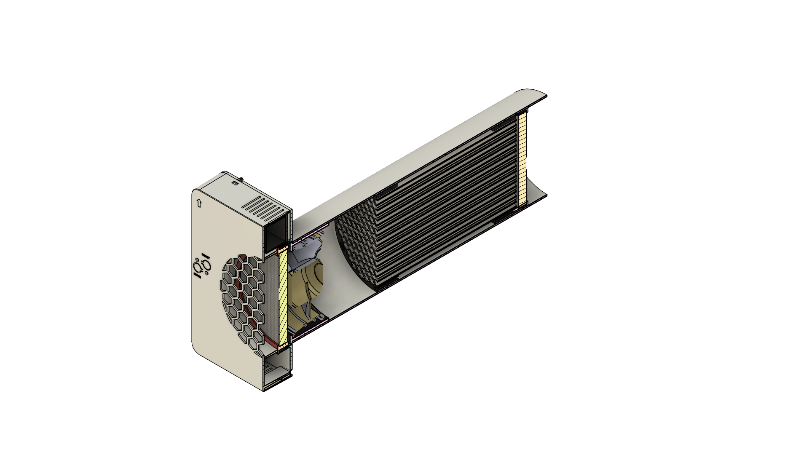
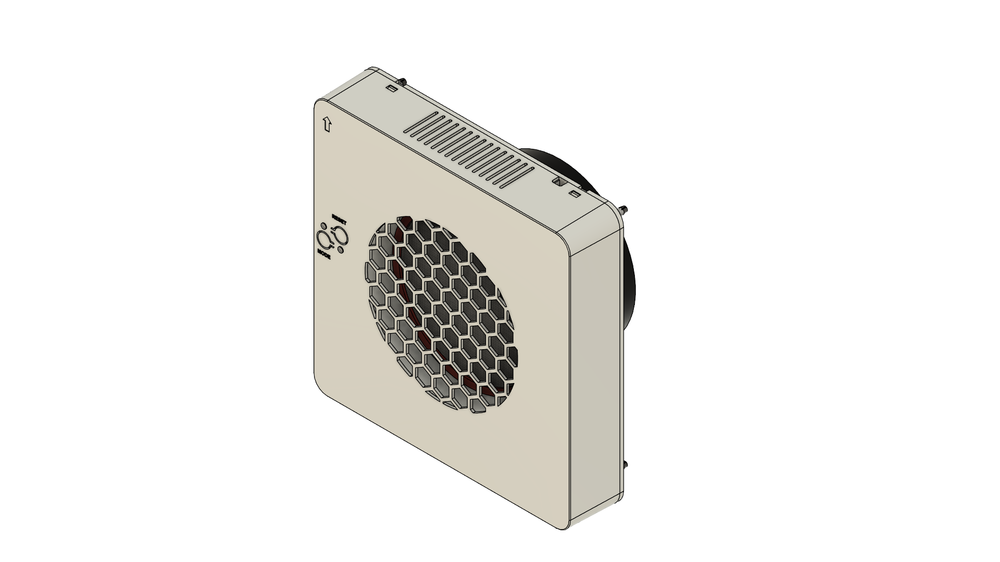
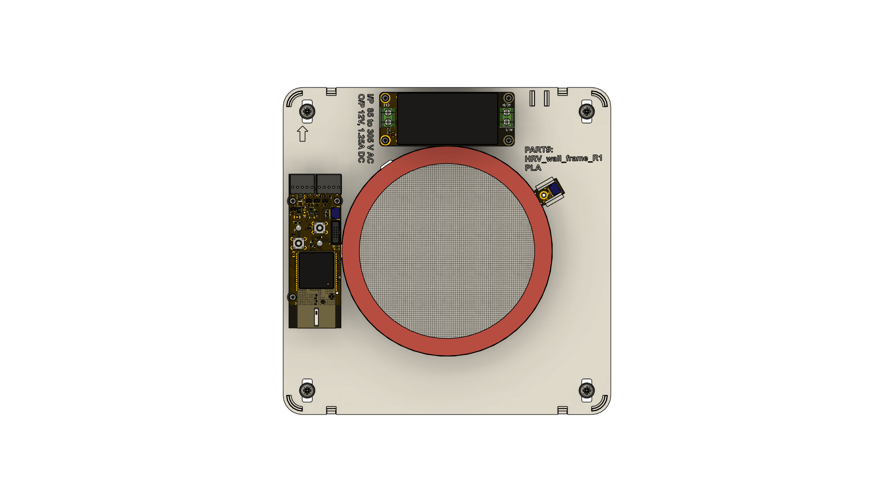
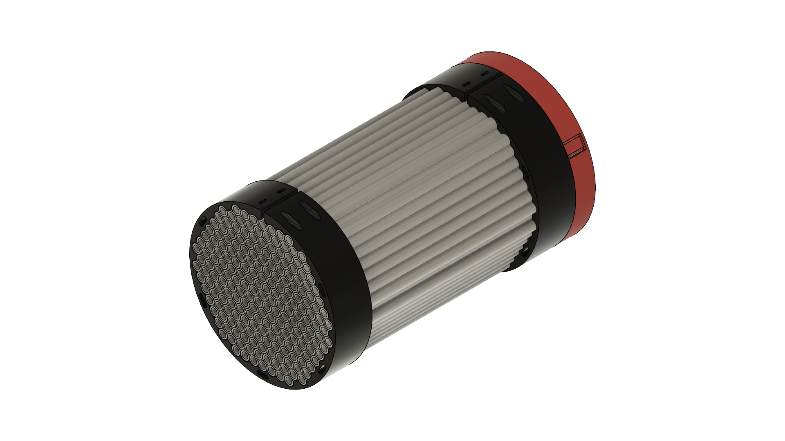

# Vayu
Vayu is a smart ventilation system with heat recovery

# Problem
During winter time when the temperature is in single digit or below, the windows are kept shut and sealed so that radiators can work their magic.
The quality of indoor air gets very bad as the day goes by. The current ventilation system is basically a hole (ranging rom 100mm to 150mm in diameter) in the wall with some filter and vent with open/close mechanism.
This system does not provide enough air flow inside room specifically when the room is sealed. In order to make the indoor quality better the air needs to be forced/pumped inside the room.
Since the outside temperature is very low it needs to be heated and filtered before it can be pulled inside the room. 

# Focus of the project
- The aim of the project is to provide a ventilation system that can provide fresh room temperature air. We do this by recovering the heat from the air in the room itself.
- The system must be smart enough such that the "Heat recovery" should be performed automatically. i.e. if the outside temperature air is cold, turn on the heat recovery, if not just do normal ventilation.
- The design must be a quiet one, so we can sleep peacefully.
- Proper condensation management and defrosting functions.
- The system should have wireless capabilities in order to be an IoT device in the future.

